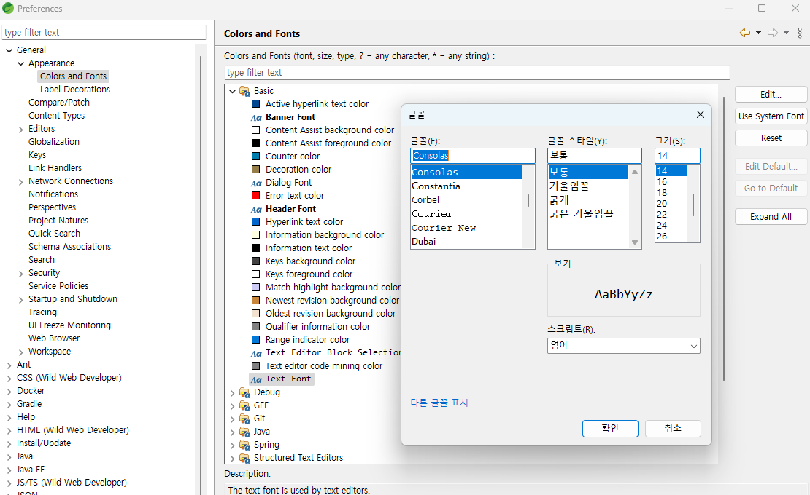

# STS4 setting Guide (Perspective)

**작성일: 25.05.17**
*참고: ITWILLBS_이연태강사님수업*

# 1. SpringToolSuite4.ini

STS 설치 폴더에 ini 파일을 메모장으로 열어서 수정함.

```ini
#생략
-XX:CompileCommand=exclude org.eclipse.jdt.internal.core.dom.rewrite.ASTRewriteAnalyzer::getExtendedRange
--add-opens=java.base/java.io=ALL-UNNAMED
--add-opens=java.base/sun.nio.ch=ALL-UNNAMED
--add-opens=java.base/java.net=ALL-UNNAMED
--add-opens=java.base/sun.security.ssl=ALL-UNNAMED
-Dosgi.requiredJavaVersion=21
-Dosgi.dataAreaRequiresExplicitInit=true
-Dorg.slf4j.simpleLogger.defaultLogLevel=off
-Dsun.java.command=SpringToolSuite4
-Dp2.trustedAuthorities=https://download.eclipse.org,https://archive.eclipse.org,https://cdn.spring.io
-Xms2048m # 수정해야 할 값 1
-Xmx2048m # 수정해야 할 값 2
# 자신의 컴퓨터 메모리 크기에 맞춰 최대 크기와 최초 크기를 일치 시키는 것이 좋음
# Xms -> Java 프로세스에서 사용 가능한 최초 힙 크기를 설정
# Xmx -> Java 프로세스에서 사용 가능한 최대 힙 크기 설정
#생략
```
검색 키워드: oracle jvm diagnostics guide
검색 결과1: [Oracle-garbageCollect](https://docs.oracle.com/cd/E13150_01/jrockit_jvm/jrockit/geninfo/diagnos/garbage_collect.html)
검색 결과2: [Oracle-memman](https://docs.oracle.com/cd/E13150_01/jrockit_jvm/jrockit/geninfo/diagnos/memman.html)

- H/W에 관심이 많은 분들은 잘 아시겠지만, 개발자는 여러 프로그램들을 동시에 사용가능해야 합니다.  
- 개발가이드 문서 + 개발툴(IDE) + DB툴(SqlDeveloper) + 검색용 브라우저 + (웹개발시)테스트용 브라우저 와 같이 최소 3~4개의 프로그램들을 OS 메모리에 불러놓고 사용하기에 최소 16GB, 그 이상도 좋습니다.  
- 8GB 일 경우 1024, 16GB일 경우 2048 혹은 그 이상
- JVM 메모리 할당 값을 바꾼 뒤 개발도중에 STS에서 처음 보는 오류들을 만나면, 아마도 윈도우에서 가용한 메모리를 벗어날 확률이 있기에 값을 하향 조정하는 것이 좋습니다.


# 2. STS 메뉴 -> Window -> Preferences

## 2-1. General

### 2-1-1. Heap 메모리 상태 보기
[`General`] 클릭 후
`Show heap status` 항목 체크  


### 2-1-2. 테마변경
[`General`-`Appearance`] 클릭 후  
`Theme` -> {\'Classic\', \'Dark\', \'Light\'} 변경 가능

### 2-1-3. 컬러 및 폰트 변경
[`General`-`Appearance`-`Colors And Fonts`] 클릭 후  
목록 중 `Basic` - `Text Font` -> 더블클릭 || Edit 변경 가능


### 2-1-4. file encoding 관련
[`General`-`Content Types`] 클릭 후 
`Text` 목록 중  
- `Java Properties File` 클릭 후 아랫쪽 default encoding ->> ISO-8859-1 를 UTF-8 로 변경
- `Spring Properties File` -> UTF-8
- `Spring Yaml Properties File` -> UTF-8
`Java Class File` 인코딩도 변경 가능

### 2-1-5. 탭/공백 문자 보기
[`General`-`Editors`-`Text Editors`] 클릭 후  
`Show whitespace characters` 항목 체크


### 2-1-6. 영문법 체크 해제
[`General`-`Editors`-`Text Editors`-`Spelling`] 클릭 후  
`Enable spell checking` 항목 체크 해제(문자열 영문법 체크 불필요)

### 2-1-7. WorkSpace Encoding
[`General`-`Workspace`] 클릭 후  
`Text file encoding` - Other -> UTF-8

## 2-2. Java

### 2-2-1. 컴파일러 버전 수정
[`Java`-`Compiler`] 클릭 후  
`Compiler compliance level` -> 프로젝트에 맞는 버전

### 2-2-2. 설치된 JREs 관리
[`Java`-`Installed JREs`] 클릭 후  
목록에 설치된 자바가 없을 경우 [Add] 클릭 
`Standard VM` 선택(기본) [Next] -> JRE home 항목 [Directory] 클릭 후
설치된 JDK 폴더 선택


## 2-3. Run/Debug

### 2-3-1. 콘솔 로그 리미트 해제
[`Run/Debug`-`Console`] 클릭 후  
`Limit console output` 체크 해제


## 2-4. Server 

### 2-4-1. 실행 할 서버 관리 (Springboot에서는 하지 않아도 됨)
[`Server`-`Runtime Environments`] 클릭 후  
목록에 설치된 서버가 없을 경우 [Add] 클릭  
목록 중 설치된 서버 버전을 선택 하여 [Next]


## 2-5. Web

### 2-5-1. CSS encoding
[`Web`-`CSS Files`] 클릭 후  
`Encoding` UTF-8 확인

### 2-5-2. HTML encoding
[`Web`-`HTML Files`] 클릭 후  
`Encoding` UTF-8 확인

### 2-5-3. JSP encoding
[`Web`-`JSP Files`] 클릭 후  
`Encoding` UTF-8 확인

## 2-6. XML

### 2-6-1. XML encoding
[`XML`-`XML Files`] 클릭 후  
`Encoding` UTF-8 확인

### 2-6-2. XML 에러 없애기
[`XML`] 클릭 후  
`Download external resources like referneced DTD, XSD` 체크  


# 3. STS 메뉴 -> Perspective -> Customize Perspective

## 3-1. JUnit 추가
`Menu Visibility` 클릭 후
목록 중 `File`-`New`-`JUnit Test Case` 체크


